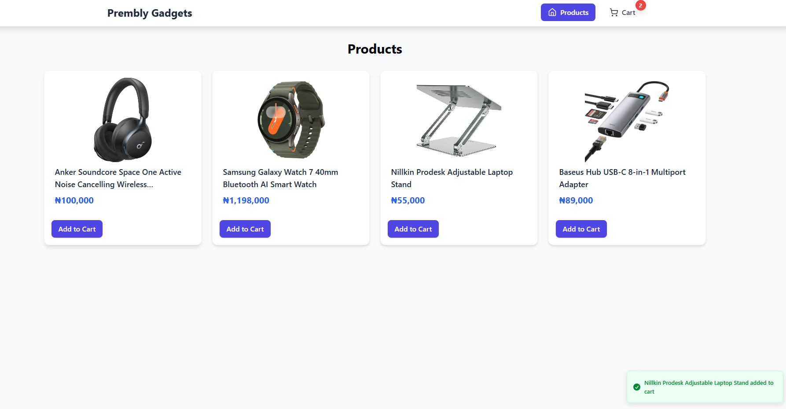
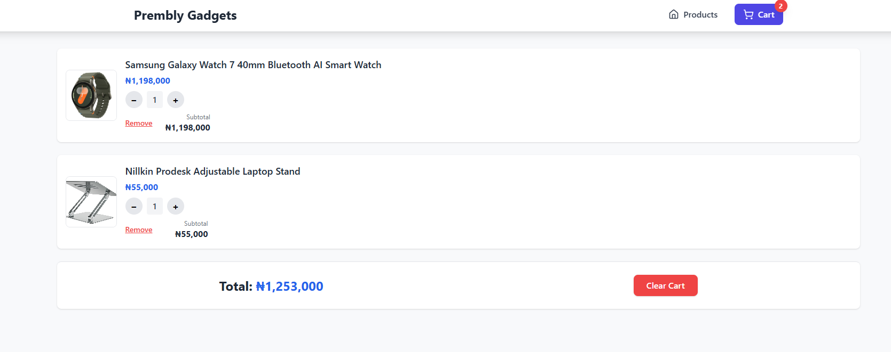
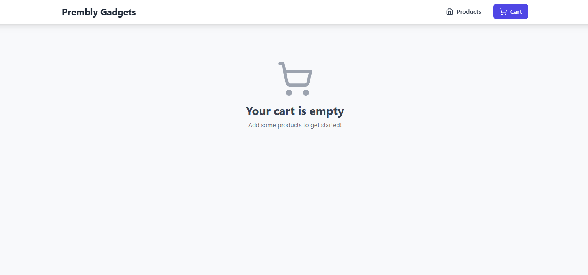
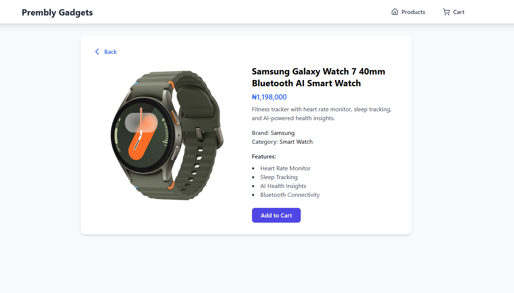
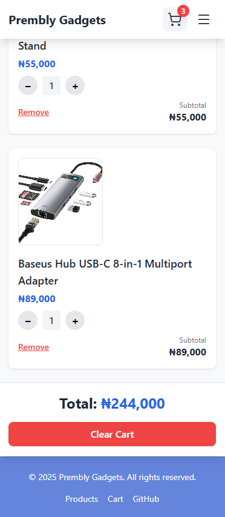
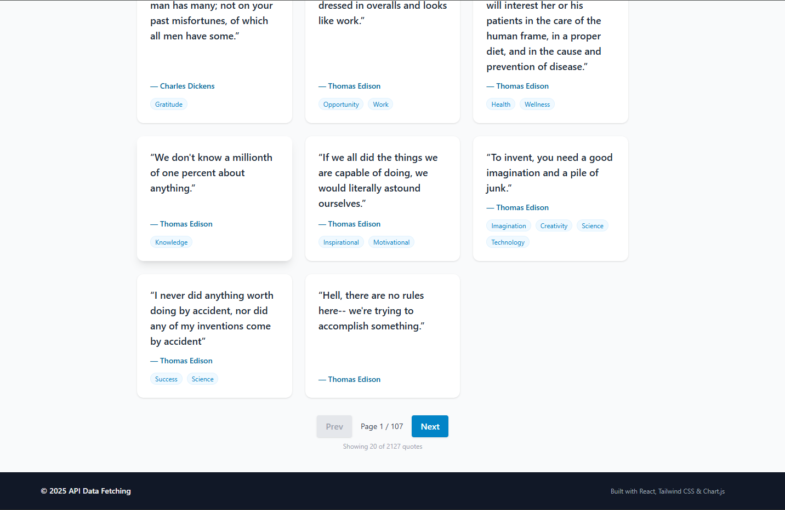
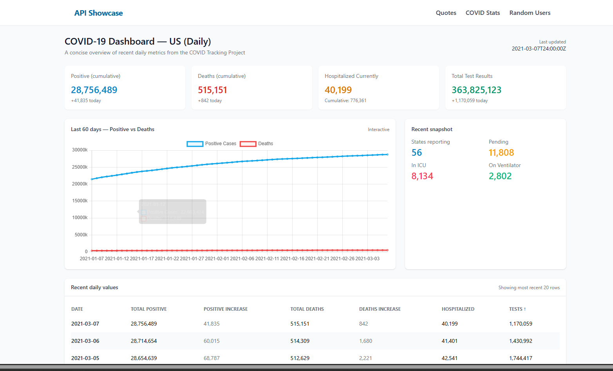
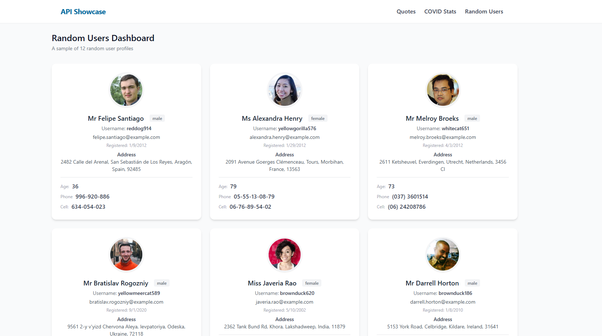
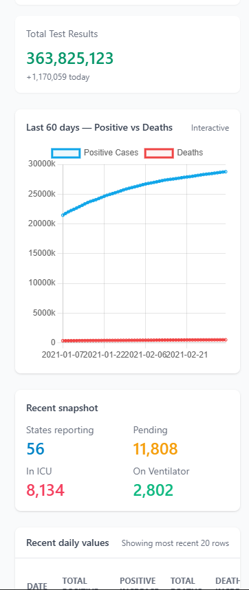

# Frontend Developer Technical Assessment — Solution

This repository contains three separate projects as requested:

- **/shopping-cart-js** — Shopping cart in React (JS) + Redux + React Router.
- **/shopping-cart-ts** — TypeScript conversion of the shopping cart with strict typing.
- **/api-data-fetching** — Components to fetch data from public APIs with loading/error states.

Each folder is a Vite project with its own dependencies. Follow the setup steps inside each subfolder's README.

All applications are fully responsive

## Screenshots

### Shopping-cart

### API Data Fetching

